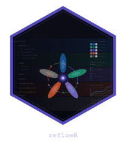

# reflowR 

> Themed extensions for workflowr research workflows

<!-- badges: start -->
[](https://lifecycle.r-lib.org/articles/stages.html#experimental)
[](https://github.com/r-heller/reflowR/actions/workflows/R-CMD-check.yaml)
[](https://r-heller.github.io/reflowR/)
[](https://app.codecov.io/gh/r-heller/reflowR)
<!-- badges: end -->

## Overview

**reflowR** extends the [workflowr](https://workflowr.github.io/workflowr/) package with themed color schemes, structured analysis pipeline templates, and utility scripts for reproducible research. It wraps `workflowr::wflow_start()` to create a standard workflowr project, then layers on a complete theming and scaffolding system.

### Theming

- **5 color schemes** -- clinical (red), basic research (steelblue), code/statistics (forest green), special (purple), other (grey) -- each with a custom SVG icon, 8-color palette, and full CSS/SCSS theme
- **ggplot2 theme + table styling** that automatically matches the selected scheme
- **Themed navbar** with gradient, icon, and pipeline dropdown menu

### Scaffolding

- **3 depth presets** -- minimal (3 steps), standard (8 steps), extended (12 steps) -- providing a structured Rmd analysis pipeline
- **6 utility scripts** in `code/` -- setup, utils, formulary, data I/O, table helpers, plot helpers
- **Quarto report template** with dual HTML/PDF output

All generated projects remain fully compatible with standard workflowr commands (`wflow_build()`, `wflow_publish()`, etc.).

## Installation

```r
# install.packages("pak")
pak::pak("r-heller/reflowR")
# workflowr is installed automatically as a dependency
```

Or using remotes:

```r
remotes::install_github("r-heller/reflowR")
```

## Quick Start

```r
library(reflowR)

# Create a clinical research project with the standard 8-step pipeline
reflow_init(
  directory = "~/projects/my_analysis",
  author    = "Your Name",
  email     = "you@example.com",
  scheme    = "clinical",
  depth     = "standard"
)

# Then use standard workflowr commands:
workflowr::wflow_build()
workflowr::wflow_publish("analysis/*.Rmd", message = "Initial build")
```

## Color Schemes

| Scheme | Label | Primary | Use Case |
|--------|-------|---------|----------|
| `clinical` | Clinical Research | `#C8102E` | Clinical trials, patient data |
| `basic` | Basic Research | `#4682B4` | Lab research, general science |
| `code` | Code & Statistics | `#228B22` | Software dev, statistical methods |
| `special` | Special | `#6A0DAD` | Special projects, reviews |
| `other` | Other | `#2C2C2C` | Neutral, multipurpose |

Preview any scheme interactively:

```r
reflow_preview("clinical")
reflow_schemes()
```

## Depth Presets

| Preset | Steps | Best For |
|--------|-------|----------|
| `minimal` | 3 | Quick explorations, side analyses |
| `standard` | 8 | Standard research projects, publications |
| `extended` | 12 | Clinical trials, comprehensive studies |

```r
reflow_presets()
```

## How It Works

reflowR calls `workflowr::wflow_start()` to create the standard workflowr scaffold, then enhances it with themed files. The result is a standard workflowr project -- all workflowr commands work as expected.

## Getting Help

- Browse the [function reference](https://r-heller.github.io/reflowR/reference/index.html)
- Read the [Getting Started vignette](https://r-heller.github.io/reflowR/articles/getting-started.html)
- File issues at [GitHub Issues](https://github.com/r-heller/reflowR/issues)

## Citation

```r
citation("reflowR")
```

## Contributing

Contributions are welcome. Please open an issue first to discuss what you would like to change, then submit a pull request.

## License

MIT
